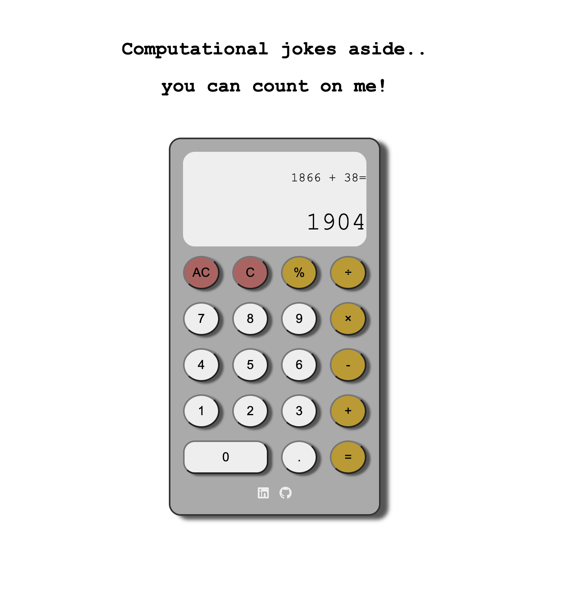

# Calculator 🔢

An online calculator built using HTML5, CSS3 and Vanilla JS. Operated either by keyboard or mousepad.

🔗 [Live Preview](https://miguelbelo95.github.io/calculator/)

# 🛠️ Features

- All basic operations are supported (divide, multiple, remainder, add, subtract).
- Keyboard inputs and mouse click events are supported

# 📚 Lessons Learned...

I had to re-factor my work several times as I realized how different functions and variables interacted with each other. The initial architecture didn't worked properly on the delete and Clear button. Looking forward to see how future projects will enable me to make more efficient programs. With these project I've learnt:

- How to handle Keyboard Input and mouse click events for the same functionalities
- Use of Unicode code point for HTML display of operator buttons
- Structure my logic and boolean variables to act as switch buttons [On / OFF]

There are some bugs I've realised that can't really know how to solve them, such as:

- If you input some numbers through the keyboard super fast, some of those numbers will remain with a "pressed" effect, through CSS. That is because my function that listens for keys pressed has a setTimer() function to remove the CSS class of that "pressed" effect of 100ms, and if you press another key faster than that, the setTimer function won't have time to run. Javascript does not allow multithreading, so I can't see another work around.
- On mobile, since when pressing the multiply button doesn't display 'x' but instead '\*' , so I've added these two as valid inputs for multiplication. Instead, I wanted to be able to convert the '\*' to 'x', but that only runs on the computer browser.

# 🙌 Acknowledgement

Project inspiration from [The Odin Project](https://www.theodinproject.com/paths) path.
